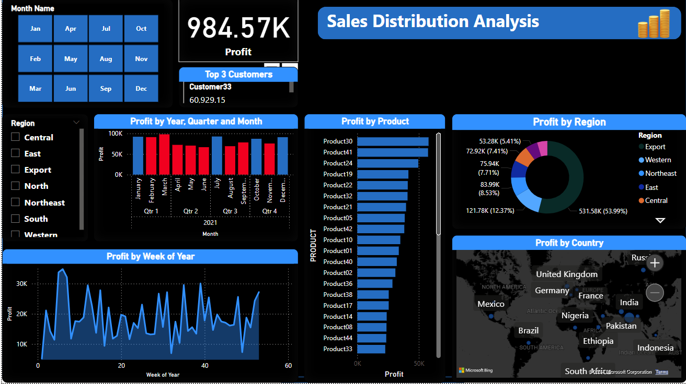

# Sales Distribution Analysis
Appling skills to ivestigate sales distribution.

## Implemntaion Steps
### Step 1: Data Modeling and EDA.
Importing your data into Power BI and creating your data model. Once your data is ready, we will start doing some initial exploratory data analysis.

* Creating Measures
  * ```Profit = CALCULATE(SUM('Input Data'[Profit]),CROSSFILTER('Input Data'[Month],Target[Month],Both) )```
  * ```Target = CALCULATE(SUM(Target[Target]),CROSSFILTER('Input Data'[Month],Target[Month],Both) ) ```
  * ```Profit Vs Target = CALCULATE(DIVIDE([Profit],[Target]),CROSSFILTER('Input Data'[Month],Target[Month],Both) ) ```


# Final Dashboard Layout


